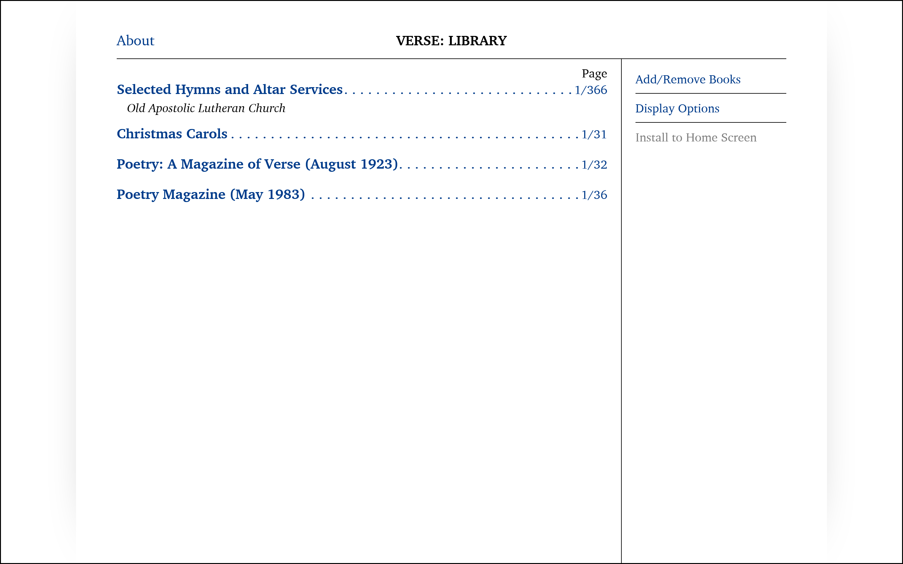
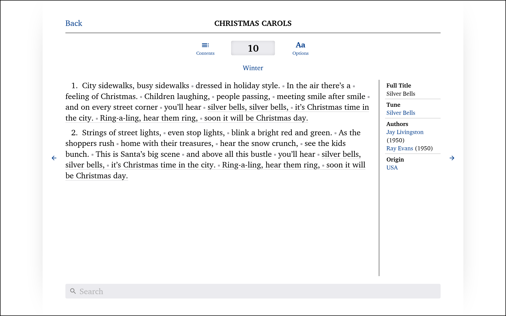
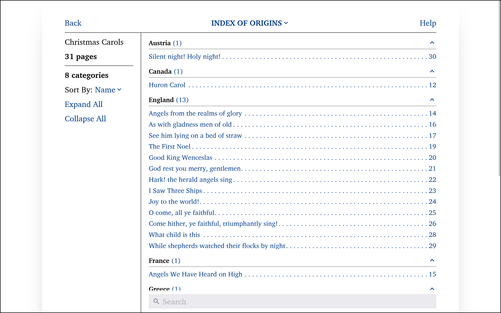

# Verse

> Metrical or rhymed composition as distinct from prose; poetry.

[versereader.netlify.app](https://versereader.netlify.app)

A web application for viewing collections of verse. It is currently geared towards song books, but the goal is to eventually support other types of verse, including poetry. It imports VerseXML files (see below) that contain a structured collection of pages of verse.

Offers rapid navigation, page display customization, and intuitive search and find features.


---

<details>
<summary>More screenshots:</summary>

Mobile flow (library/read/search):


Options dialog (mobile):


Library page:


Reading page:


Table of Contents/search:


Grouping by origin:


</details>

---

From the beginning, the goal of this app has been to create a dynamic book. My personal use-case is as a digital version of a paper church hymnal.

As a personal project that I started in order to gain programming experience, I made a number of development decisions that would not be optimal in normal circumstances. These include not maintaining a clean Git history, experimenting heavily with different approaches (such as using Custom Elements for listboxes and select components; and a failed attempt at using a horizontally scrolling `body`, CSS scroll-snapping, and an [IntersectionObserver](https://developer.mozilla.org/en-US/docs/Web/API/Intersection_Observer_API) to get highly performant swipeable pages), completely re-structuring my code numerous times, spending agonizing amounts of time trying to make a particular bit of code easily understandable in an effort to make easily-read code come more naturally, designing the visual style on-the-fly, and ignoring some things like internationalization entirely. And these experiments have given me experience in way more ways than I bargained for when I started out.

But even though this is a personal project, I have very much tried to make it as professional and real-world as possible.

-  It is accessible, and I have extensively tested it with various screenreaders (a very enlightening experience—in my opinion, testing with a real screen reader is absolutely required).

-  It is fully-typed in TypeScript, as much as I could do so.

-  It uses minimal dependencies, but I avoided recreating the wheel when there was no need to. For example, I use [React Router](https://reactrouter.com/en/main/start/overview) for a client-side router and [Lunr](https://github.com/olivernn/lunr.js) for search indexing because those are both complex libraries that I couldn't realisticalyy replicate or improve, but I wrote my own CSS styles from scratch because existing CSS frameworks are far too inflexible. I also avoided using CSS libraries like [Tailwind](https://tailwindcss.com/) because it just wasn't necessary and would only add more complexity. One dependency that I would like to get away from is Create React App in favor of a more lightweight bundler, but that's a task for another day.

-  It is fully-functional offline, requiring no Internet access beyond the initial page load. Furthermore, it stores all data locally in the browser using LocalStorage and IndexedDB. Together, this means that the app can cheaply and easily be served from any basic webserver.

-  It smoothly scales to all screen sizes, from large 30" monitors to small phones like the original Apple iPhone SE.

## Features

## Project Status: Early BETA

☑ Feature complete. No new features need to be added for basic usage. Once bug-fixing and other testing is complete, I am comfortable calling this project "done".

☐ Further accessibility testing with a screen reader. Lots of tweaks have been made to the Page and Search pages to make them as accessible as possible. The Library and Manage Books pages still need some work. 85% complete.

☐ Bug fixing: Mostly complete, but there are a few minor things to fix

☐ The "Manage Books" dialogue is still in BETA, but that is not required for basic usage of the app.

### Wish List

-  Performance improvements:

   -  The Contents (search index) page loads rather slowly if there are too many page entries. This is a React problem that is hard to get around: too many DOM elements and it sort of just falls down. I'd like to switch to a different rendering library like SolidJS.

   -  Improve Library loading times by pre-saving critical page data at time of import rather than opening every file in the library on-the-fly.

-  Swipe to next/previous page: This one is very tricky. I have no idea how to make this work with scroll restoration AND an auto-hiding header, unless I make an inner element scrollable and make the body fixed—but that comes with many downsides, including scrollbar position, and breaking scroll-to-hide of mobile browser toolbars. The only way I can think of is to make the header also swipe away, and a new duplicate header slides in with the new page.

-  Dialog exit and entry animations

-  Bundler change: Create-React-App is very limiting, particularly for stuff like Web Workers or PostCSS transformations, and it has way too many dependencies I don't need or understand. I might switch to another bundler such as Vite or ESBuild.

-  Error management: Right now, any errors will trigger a global error message. I want more fine-grained error messages that only affect the components they occur in.

-  Improve search syntax: Allow for free-form search of page attributes, like author:john or author:"john smith". Right now, only the page attribute ID can be used with a weird syntax.

-  Validation of imported XML files

-  Change the custom XML schema to be more like [DocBook](https://en.wikipedia.org/wiki/DocBook), with a less database-like structure and more flexibility in text formatting. This will be a breaking change.

-  Remove the dependency on `fontoxpath`. Far too heavy for my tastes. I should be able to use a lightweight library or native browser APIs for my use case.

## VerseXML

VerseXML is a custom XML document type that contains a structured collection of verses in book form. It is described by the [linked XML Schema](/schema.xsd). It is currently very experimental and will change significantly in the future.

A basic VerseXML file looks like this:

```xml
<?xml version="1.0"?>
<book
   xmlns="versereader.app"
   xmlns:xsi="http://www.w3.org/2001/XMLSchema-instance"
   xsi:schemaLocation="versereader.app/schema.xsd"
   title="Sample"
   year="2022"
   language="en"
>
   <languages>
      <language id="en" name="English" />
   </languages>
   <topics>
      <topic id="winter" name="Winter"/>
   </topics>
   <origins>
      <origin id="usa" name="USA"/>
   </origins>
   <tunes>
      <tune name="Jingle Bells" id="jingle-bells"/>
   </tunes>
   <pages>
      <page id="1">
         <topic ref="winter"/>
         <origin ref="usa"/>
         <tune ref="jingle-bells"/>
         <title>Jingle Bells</title>
         <verses>
            <verse>
               <line>Dashing through the snow</line>
               <line>in a one-horse open sleigh,</line>
               <line>o’er the fields we go</line>
               <line>laughing all the way!</line>
               <line>Bells on bob tail ring</line>
               <line>making spirits bright,</line>
               <line>what fun it is to ride and sing</line>
               <line>a sleighing song tonight! Oh!</line>
            </verse>
            <chorus>
               <repeat>
                  <line>Jingle bells, jingle bells,</line>
                  <line>jingle all the way.</line>
                  <line>Oh! what fun it is to ride</line>
                  <line>in a one-horse open sleigh.</line>
               </repeat>
            </chorus>
         </verses>
      </page>
   </pages>
</book>
```

## Developer Info

This project was bootstrapped with [Create React App](https://github.com/facebook/create-react-app).

### Practices and Terminology

#### CSS

-  Global CSS variables start with uppercase letters. These are defined in `:root` and may be referenced anywhere, including in JavaScript.

-  Lower-case CSS class names are utility classes. Located in `src/styles/_util.scss`.

-  CSS class names that start with an uppercase letter are _namespaced_ classes. These are related collections of classes located in a single file (`src/styles/MyNamespace.scss`). Rules in namespaced CSS files do not reference other namespaces.

-  Classes that start with a hyphen are direct children of a namespaced class. Rules that reference these classes must not do so with the general descendant (space) CSS combinator, but must directly reference it by some other means (paired with a class, with the child (`>`) combinator, etc.) to avoid conflicts with rules in other files. These are either used for small classes that are tightly linked with the parent element, or for states (using a double hyphen --). Avoid using them too heavily.

-  By convention, classes or CSS variables that end with `--xyz`, are states or variations on the unpostfixed class/variable. For example, `--TEXT-color` is the primary text color, and `--TEXT-color--light` is a subdued variation of the primary text color.

#### `loc`

Short for location. The short-form `loc` specifically refers to an address/ID of a page. Inspired by Amazon Kindle's use of the term to identify precise locations within an otherwise unpaginated e-book.

### Available Scripts

In the project directory, you can run:

#### `npm run start`

Runs the app in the development mode. Open [http://localhost:3000](http://localhost:3000) to view it in the browser.

The page will reload if you make edits. You will also see any lint errors in the console.

#### `npm run build`

Builds the app for production to the `build` folder. It correctly bundles React in production mode and optimizes the build for the best performance. The build is minified and the filenames include the hashes.
